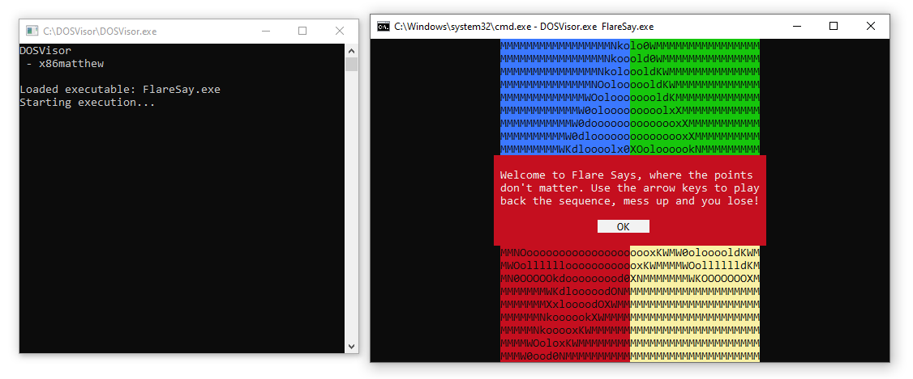

# DOSVisor

## Overview
This project is a DOS emulator that utilises the Windows Hypervisor Platform (WHP) API to create a virtual CPU, enabling the execution of DOS programs within a virtualised 16-bit real-mode environment on modern Windows systems.

In my previous Windows 3.1 emulator, the 80286 CPU was fully emulated in software. However, for this project, I decided to take a different approach by using hardware virtualisation for the CPU while emulating only the DOS layer in software.

This emulator primarily serves as a demonstration of the WHP API and is not intended to function as a complete DOS emulator. Minimal DOS functionality has been implemented, sufficient only to run a few sample programs, although the framework has been designed to be easily extendable.

## Details
### CPU Initialisation

The emulator initialises a virtual CPU using the WHP API, configuring it to run in real-mode by ensuring that the PE (Protected Mode Enable) and PG (Paging) bits are disabled in the CR0 register.

### Memory Layout

The DOS executable is mapped into the emulator host and shared with the guest at the appropriate physical address, simulating the memory layout of a real DOS system.

### Interrupt Handling

Most DOS functionality occurs via interrupts, such as 0x21 for system services and 0x10 for video operations, which must be emulated manually in software. Interrupts do not inherently trigger VM exits, and require additional tricks to capture them. This is easily addressed by implementing a custom Interrupt Vector Table (IVT) where each interrupt points to a CPUID instruction. This configuration ensures that a VM exit is triggered when an interrupt occurs, enabling the emulator to intercept and handle the interrupt.

### I/O Port Support

DOS programs often make use of I/O ports, such as for the PC speaker, CMOS, and hardware timers. I/O requests are easily captured because the `in` and `out` instructions trigger a VM exit, allowing the functionality to be emulated. Currently, only a very small set of common I/O requests are supported.

### Timer Emulation

DOS programs used various methods for maintaining timing. This emulator includes support for a select few of these mechanisms:

- **System BIOS Counter at 0000:046C:** A 32-bit counter that increments at a rate of 18.2065 Hz.
- **RAM Refresh Toggle Bit at IO Port 0x61:** A single bit that toggles every 15 microseconds.
- **System Clock via INT 0x1A:** Returns the BIOS counter value from `0000:046C`, an alternative to accessing the memory directly.
- **RTC Registers via IO Port 0x70/0x71:** Returns the current time from the CMOS controller.
- **Current Time via INT 0x21:** Returns the current system time from the main DOS function dispatcher.

The 8253 PIT timer is not fully implemented at this time.

### Keyboard State Monitoring

The emulator monitors the keyboard state and maintains a simple key buffer, passing information to the DOS program via keyboard interrupts (0x16) as necessary.

### Terminal Command Support

Basic terminal commands are supported, allowing the emulator to run simple text-based games and other basic programs.

### System Fields

The emulator currently allocates space for system fields, such as BIOS data areas and the Program Segment Prefix (PSP). However, these fields are not currently populated, except for the BIOS counter value. Additional fields can be populated as necessary.

## Testing

Testing has been performed using a simple DOS game from FlareOn 2023 (FlareSay.exe, challenge #6), primarily because it was the only DOS executable on my hard disk at the time.

## Future

In addition to this DOS emulator, I have had some success with a similar concept aimed at emulating 64-bit/32-bit Windows user-mode programs. By building up a simulated CPL3 environment and hooking the MSR_LSTAR register, it is possible to emulate an executable and force a VM exit on system calls. This allows the emulator to capture and either forward the system call request to the host OS or intercept it. This technique does come with many complications, but there may be valid use cases where a lightweight emulator could be useful.

